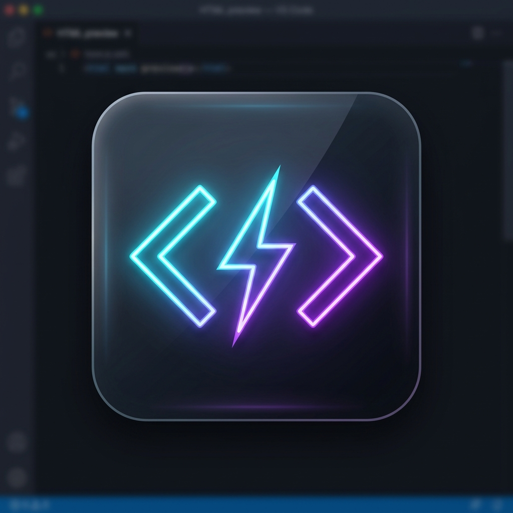

# Live Preview HTML ⚡

<p align="center">
  
</p>

A premium, fast, and feature-packed universal previewer for VS Code. **Live Preview HTML** allows you to open and preview HTML, Markdown, XML, CSV/SSV, PDFs, images, audios, and videos concurrently. It supports real-time synchronization, responsive viewport simulation, direct webview image zooming/panning, and premium media players—all side-by-side inside your workspace.

---

## ⚡ Key Features

- 👁️ **Simultaneous Multiple Previews**: Open and arrange multiple live previews side-by-side. Supports opening multiple panels for the same file as well!
- ⚓ **Relocated Header Controls**: Easy-access controls positioned at the start of the header next to the logo:
  - ❌ **Close button** to instantly close the current preview tab.
  - 🔄 **Reload button** to refresh the document.
  - ☰ **Dropdown Menu** to open in system browser, open developer tools, or manage active servers.
- 📁 **Universal File Previews**:
  - **HTML/CSS/JS**: Real-time keystroke synchronisation and scroll-preserving hot-reload using Server-Sent Events (SSE).
  - **Markdown**: Beautifully rendered text conversion with dual-mode inline editing (rendered Preview vs. monospace Textarea Editor) and saving synchronized directly with VS Code workspace text buffers (preserving undo history) or direct disk write.
  - **XML**: Formatted documents with colorful syntax highlights.
  - **CSV/SSV**: Comma, semicolon, tab, or space-separated files are auto-detected and parsed into readable data tables.
  - **PDFs**: Premium client-side rendering via a custom PDF.js canvas viewer, bypassing native Chromium plugin blocks in VS Code webviews. Features a togglable page preview sidebar, search page numbers, page navigation, ink drawing overlay (draw directly on pages), high-DPI scaling, dynamic zoom fits (Fit Page, Fit Width, Automatic, and custom percentage zoom), print/download binds, and a dropdown menu for advanced layout options (Go to First/Last Page, Rotate Clockwise/Counterclockwise, Hand Tool panning, Page Scrolling Modes [Vertical, Horizontal, Wrapped], and Spreads layout [No Spreads, Odd Spreads, Even Spreads]).
- 🖼️ **Direct Image Rendering (Bypass Server)**: PNG, JPG, JPEG, WEBP, GIF, and SVG files load directly in the webview via `asWebviewUri`. Features support for:
  - Smooth click-and-drag panning.
  - Zoom in, zoom out, and mouse-wheel scrolling.
  - Reset scale button.
  - ℹ️ **File Info Overlay**: A togglable glassmorphic overlay showing filename, size, format, last modified, and resolution.
- 🎥 **Modern Custom Video Player**: Premium controls for MP4, WebM, MOV, MKV, and AVI. Custom timeline scrubber, play/pause overlay, volume/mute button, speed selector (0.5x to 2x), Picture-in-Picture mode, fullscreen support, and keyboard hotkeys. Binds directly to media events to prevent play state desyncs.
  - ℹ️ **File Info Overlay**: Togglable panel displaying name, size, resolution, last modified time, and video duration.
- 🎵 **Audio Player & Canvas Waveform**: Custom player for MP3, WAV, OGG, M4A, FLAC, and AAC, featuring a dynamic `<canvas>` waveform visualizer analyzing frequencies in real-time.
- 📡 **Range Request Support**: HTTP Range (status `206`) requests enable seeking, scrubbing, and fast buffering for video/audio.
- 📱 **Responsive Viewport Simulator**: Toggle between Desktop (PC), Mobile (375x667px simulation), or Custom dimensions (width/height input boxes) instantly.
- 🌐 **Browser Preview Mode**: Enter any HTTP/HTTPS website URL in the address bar to browse external websites directly inside the Live Preview panel.

---

## 🚀 Upcoming Features (Roadmap)

- 💻 **Console Log Overlay**: A mini console panel at the bottom of the preview tab to trace Javascript logs and errors without opening VS Code DevTools.
- 📊 **CSV to Interactive Chart/Graph**: Visualise tabular CSV/SSV data in the preview panel with interactive chart rendering.
- 📱 **QR Code Device Sync**: Scan a generated QR code with your mobile device to test and interact with the live server in real time.
- 🎨 **Sleek Theme Selector**: Customisable preview environment themes (glassmorphic dark, cyber neon, light mode, sepia) to match user preference.
- 🌐 **Remote Proxy Tunneling**: Safely tunnel local server previews to share external progress links with collaborators or clients.

---

## 🤝 Open Source & Contributions

This is an open-source project! We welcome developers to contribute, submit bug reports, suggest improvements, and build features.

1. **Fork the repo** on [GitHub](https://github.com/Rupesh9369/htmlpreview-vscode).
2. **Create a branch** for your feature: `git checkout -b feature/amazing-feature`.
3. **Commit your changes**: `git commit -m "Add amazing feature"`.
4. **Push your branch**: `git push origin feature/amazing-feature`.
5. **Open a Pull Request**!

---

## Installation & Setup

### Instant Dev Testing (F5)
1. Open this folder (`c:\Users\Rupeshh\Downloads\proj vs`) in VS Code.
2. Press `F5` (or go to **Run > Start Debugging**).
3. In the new host window, open `website/index.html`.
4. Click the **`⚡ Live Preview HTML`** button in the bottom status bar (or right-click and select **Live Preview HTML**).

### Permanent Global Installation
1. Open your terminal in the extension folder:
   ```bash
   npx @vscode/vsce package
   ```
2. Install the created package in VS Code:
   ```bash
   code --install-extension htmlpreview-vscode-1.0.5.vsix
   ```

---

## Info

- **Version**: 1.0.5
- **Developer**: Rupesh9369
- **GitHub**: [https://github.com/Rupesh9369/htmlpreview-vscode](https://github.com/Rupesh9369/htmlpreview-vscode)
- **License**: MIT
- **Keywords**: vscode, html, css, preview, live preview, markdown, csv, ssv, xml, pdf, image viewer, audio visualizer, video player, realtime, responsive, range requests, markdown editor, browser mode, metadata overlay.
